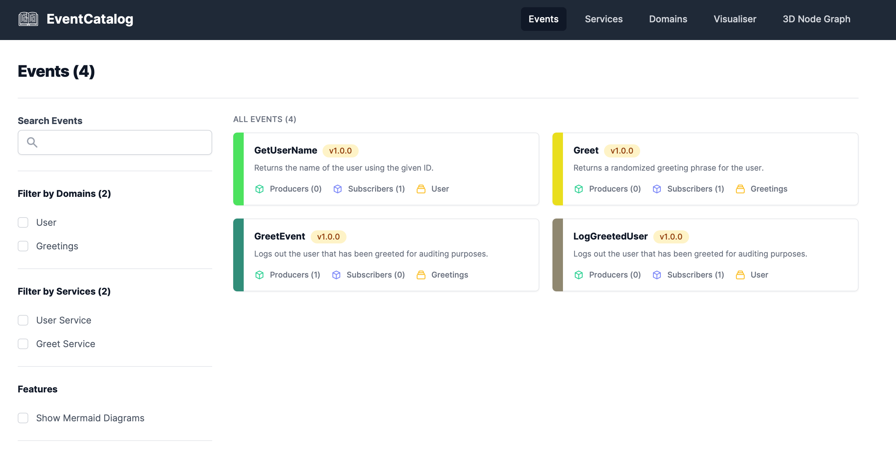

# EventCatalog: Scaffold and generate events from AsyncAPI schemas

This project helps you automate the scaffolding of [EventCatalog](https://www.eventcatalog.dev) with [AsyncAPI](https://www.asyncapi.com) support and to generate events from such schemas, including ["domain"](https://www.eventcatalog.dev/docs/domains/introduction) support.

A good use-case for this could be to generate your organization event catalog in CI, if you are a big AsyncAPI user. You'll of course have to provide the schema registry/storage in that case, but you'll be in a good position to automate the bulk of such a process using this project.

## How it works

The main build script will ask for a catalog (folder) name and use EventCatalog to generate it. After installing, it will add the [AsyncAPI plugin](https://www.eventcatalog.dev/docs/api/plugins/@eventcatalog/plugin-doc-generator-asyncapi) and copy in the provided config files and example schemas.

There are two different config files because we need the build and run phases to do different things. Also, because there seems to be problems with having a single file that does it all (the project started some time ago, so I don't remember all the details of this, to be honest).

You are free, of course, to swap the example schemas for your own ones. Note that _the naming is important_ in terms of the provided build configuration. The first part before a period will represent the "domain". The current setup also expects JSON files, not YML files.

## Create a new EventCatalog

Run `bash create-eventcatalog.sh`.

## Run the EventCatalog

Alias the `build-eventcatalog.sh` script to something like `npm start`, and then run it. This is, again, because we need to do the swapping of config files to make it work.
